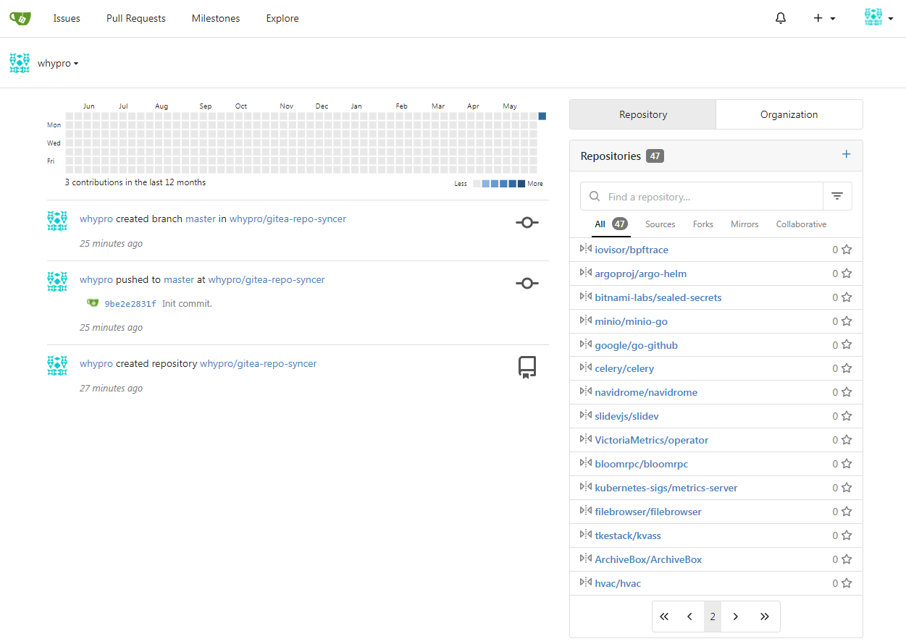

# Gitea Repo Syncer

Gitea Repo Syncer is a tool that mirror your all github starred repositories into a private [gitea](https://gitea.io) server. It also can sync repository owners by auto creating users and organizations.

## Build

This tool is write with golang. You can build it in docker using command below:

```
make docker-build
```

## Set Environment Variables

Copy env.sh.example to env.sh and set proper environment variables.

```
cp env.sh.example env.sh

vim env.sh
```

## Run

```
make run
```

## Screenshots


